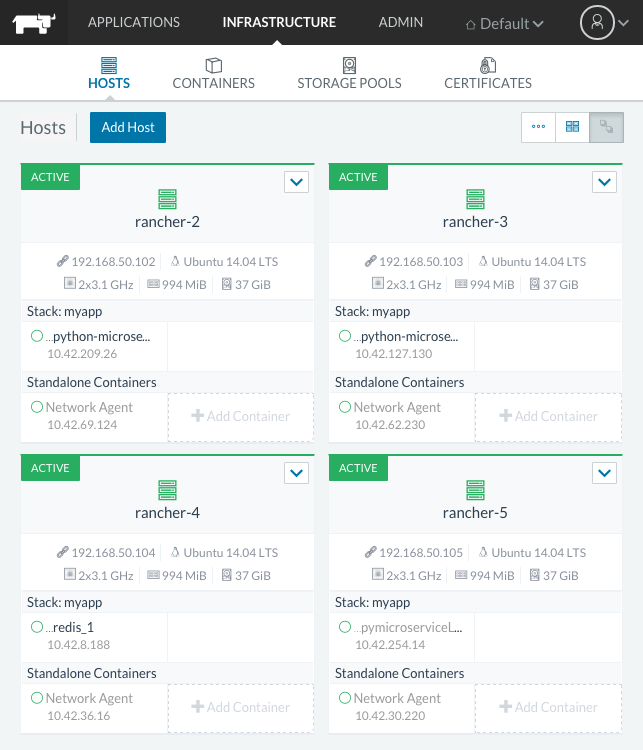
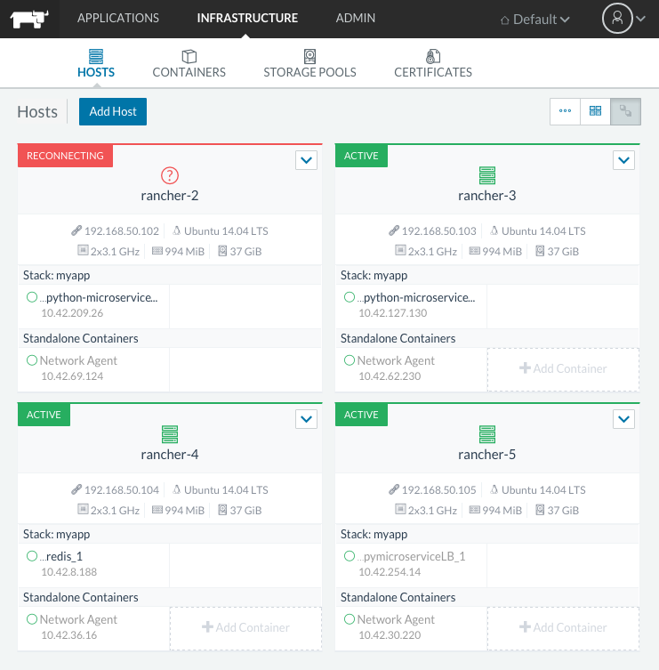

#### Failure testing

First, ensure the app is successfully deployed on a multi-node cluster:



##### SCENARIO: host goes down or is unreachable

0. In one terminal window, issue a repetitive curl call against the service:

    ```
    while sleep 1; do curl http://pyms.mycompany.tld; done
    ```

0. From the diagram above we know that one instance of the microservice is being hosted by `rancher-2`. Go to VirtualBox > right-click on `cd-poc_rancher-2` > Close > Power Off.


